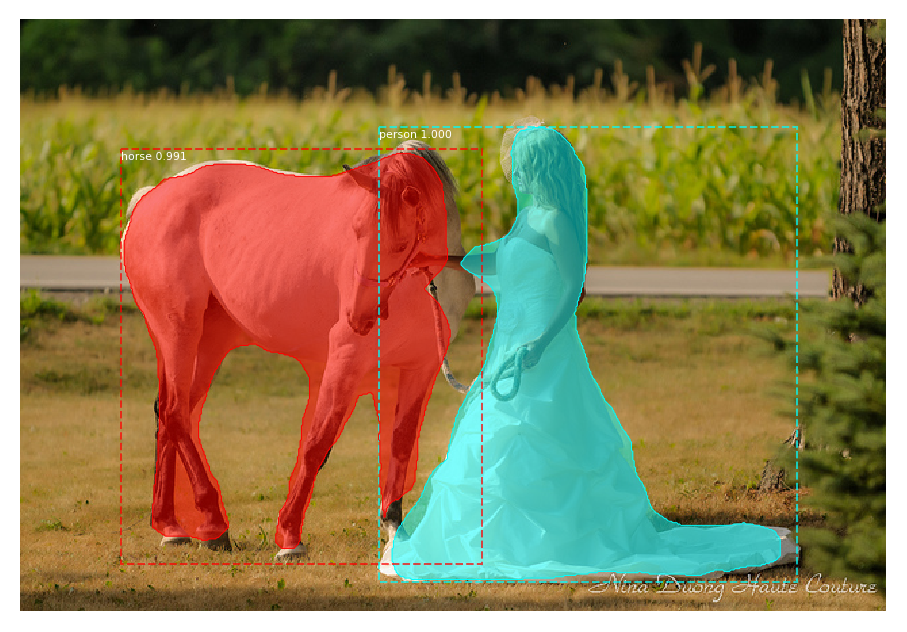
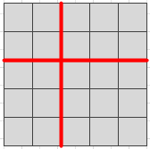
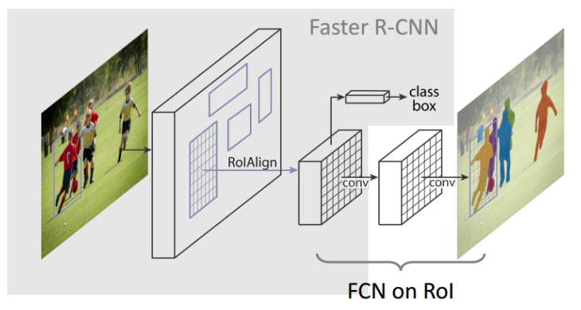

# Mask R-CNN

Mask R-CNN是在Faster R-CNN的基础上发展出来的分割网络。

#### Mask R-CNN框架主要完成了三件事：

1. 目标检测：获得目标框
2. 目标分类：找到每一个目标相应的类别
3. 目标分割：对每一个目标进行像素级别的分割

#### 算法的步骤

1. 对图像进行预处理
2. 用一个普通的卷积神经网络进行特征提取获得feature map
3. 对feature map中的每个点，获得候选ROI
4. 将候选ROI送入RPN模型进行前景与背景的二值分类(阈值选择0.3和0.7)。
5. 对剩下的ROI进行ROIAlign操作
6. 对这些ROI进行分类、Mask生成(FCN)。

#### 算法组成

Faster R-CNN、ROIAlign和FCN

- Faster R-Cnn 
    + 图像预处理(裁剪、获得特征图)
    + 根据池化程度确定锚点(最终特征图的每一个点都是一个锚点)，并根据每一个锚点来获得ROI。
        * 候选ROI：根据三种尺度的原图(128,256,512)，按照三种长宽比例(1:1, 1:0.5, 0.5:1)获得9个ROI。对于16x16的特征图，会产生16x16x9个ROI。
    + RPN：获得前景和背景分类的目标分数(确定ROI是前景还是背景)
    + 进行ROIPooling
    + 输入监测网络中，用1x1的卷积网络进行分类，并进行BB回归(Bounding-box regression，边框回归，获得更精确的窗口)
- FCN：目标分割
- ROIAlign
    + ROIPooling：对较大的ROI采用pooling。使用的是最邻近插值，对缩放坐标不为整数的情况采用了四舍五入，容易造成偏差。
        * 
    + ROIAlign：将最邻近插值换成双线性插值。

**maskrcnn框架：**

